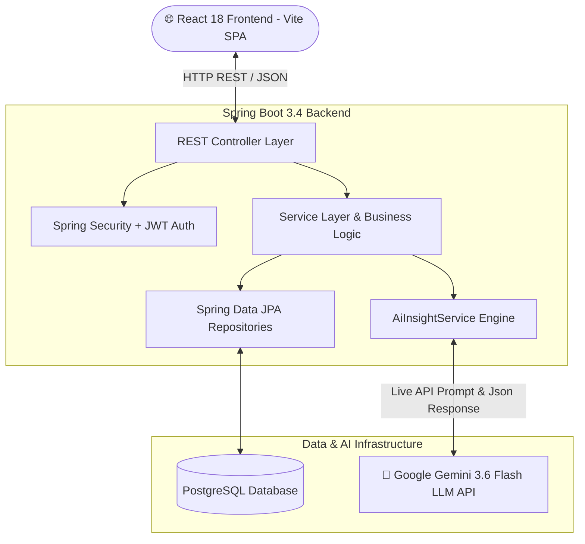

# ⚡ Full-Stack E-Commerce Platform with Live AI Product Reality Check

[](https://spring.io/projects/spring-boot)
[](https://aistudio.google.com/)
[](https://reactjs.org/)
[](https://www.postgresql.org/)
[](https://redux-toolkit.js.org/)
[](https://vitejs.dev/)
[](https://jwt.io/)

A modern, production-grade, full-stack E-Commerce platform built with **Spring Boot 3.4**, **Google Gemini 3.6 Flash LLM**, **PostgreSQL**, **Spring Security + JWT**, and **React 18** with **Redux Toolkit** and **Vite**.

Featuring an industry-first **AI Reality & Global Climate Fit Analysis** system that uses live LLM inference to analyze customer reviews, product specifications, and regional climate durability across the world!

---

## 🤖 🌟 Star Feature: AI Reality & Global Climate Fit Analysis ("Product Reality Check")

While most e-commerce apps only offer basic search or simple chatbots, **Ecommerce APP** introduces real-time AI product intelligence powered by **Google Gemini 3.6 Flash LLM**.

```
┌─────────────────────────────────────────────────────────────────────────────────────────────────┐
│ 🤖 AI REALITY & GLOBAL CLIMATE FIT ANALYSIS                                                     │
│ ─────────────────────────────────────────────────────────────────────────────────────────────── │
│ 🌟 Overall Sentiment : Highly Acclaimed (89% Buyer Approval)                                    │
│                                                                                                 │
│ 🌍 Regional Climate & Durability Intelligence:                                                  │
│   • 🌴 Humid & Tropical Climates   [Rating: 4.2/5.0]                                            │
│     "Audio performance is stellar, but synthetic leather earpads induce sweating after 40 mins"│
│   • ❄️ Cold & Sub-Zero Climates    [Rating: 4.8/5.0]                                            │
│     "Plush earcups provide excellent thermal insulation, battery holds 85% stamina in freezing"  │
│   • 🏙️ Urban & Metro Commute       [Rating: 4.9/5.0]                                            │
│     "Active Noise Cancellation neutralizes subway noise completely with solid Bluetooth"         │
│                                                                                                 │
│ 🟢 Top Buyer Praise           : • Class-leading ANC for public transit drone                     │
│                                 • 30-hour battery stamina with rapid USB-C fast charge           │
│ 🔴 Common Dealbreakers        : • Ear warmth and moisture trap in non-AC tropical heat          │
│ 👤 Ideal Buyer Profile        : Daily metro commuters, frequent flyers & remote professionals   │
│ ⚠️ Not Recommended For        : Outdoor workouts in high-humidity tropical daytime heat         │
│                                                                                                 │
│ ⚡ Generated via Live Google Gemini 3.6 Flash AI Engine                                          │
└─────────────────────────────────────────────────────────────────────────────────────────────────┘
```

### Key AI Highlights:
- **Dual-Source Live Synthesis**: Combines technical product specifications AND real database customer reviews submitted by buyers across Tokyo, London, Berlin, NYC, Mumbai, and Sydney.
- **Regional Climate Durability**: Dynamically evaluates how products perform in humid/tropical heat, freezing sub-zero winters, and dense metro transit environments.
- **Real-Time Re-Synthesis**: When a user submits a new customer review or an admin edits product specs, Google Gemini 3.6 Flash instantly re-analyzes and updates the insight card in real-time.
- **Compact Shopping Cart AI Reality Check**: Displays 1-line AI climate badges directly under cart items before checkout to prevent buyer's remorse!

---

## 🏗️ System Architecture



---

## ✨ Features Overview

### 🤖 Live AI Product Intelligence
- **Product Detail AI Reality Card**: Deep synthesis of regional fit, top praise, dealbreakers, and buyer profiles.
- **Cart Reality Check Badges**: Real-time climate ratings per item inside the shopping cart.
- **Automatic Fallback Protection**: Seamlessly switches to offline heuristic backup if network connectivity is interrupted.

### 🌐 Global Customer Reviews System
- **International Review Seeding**: Pre-loaded with authentic customer reviews across Japan, UK, USA, Germany, India, and Australia.
- **Submit / Paste Global Reviews**: Users and Admins can submit or copy real-world reviews from around the globe (Rating, Title, Comment, and User City/Country).
- **Quick-Add Sample Global Reviews**: One-click action to populate international sample reviews for instant AI demonstration.

### 👑 Admin Management Portal (`/admin`)
- **Interactive Dashboard**: Total sales, revenue metrics, total orders, and average order value.
- **Product Management with Live Search & Category Filters**:
  - Live search bar by product name or description.
  - Category dropdown filter (Electronics, Fashion, Home, Books, Fitness, Beauty).
  - One-click **Reset Filters** toolbar button.
- **Photo Settings & Image Resolver**:
  - Paste any custom **Internet Image URL** (Unsplash, CDN, or web links).
  - Or click **Upload File** to upload local image files directly.
  - Live thumbnail image preview in modal before saving.
  - Extended DB column storage (`VARCHAR(2000)`) preventing URL truncation.

### 🛒 Shopping Experience & Checkout
- **Dynamic Catalog**: Grid View / List View switcher with multi-field sorting (Price, Newest, A-Z).
- **Persistent Shopping Cart**: Database-backed cart synchronized across user sessions with free shipping thresholds.
- **Multi-Method Checkout**: Cash on Delivery (COD), Credit/Debit Card, UPI, and Net Banking.
- **Order Tracking**: Real-time order status tracking (`Order Accepted`, `Shipped`, `Out for Delivery`, `Delivered`).

### 🔐 Security & Access Control
- **Stateless JWT Authentication**: Secure authentication via JSON Web Tokens with password hashing (`BCryptPasswordEncoder`).
- **Role-Based Access Control (RBAC)**: Enforced roles (`ROLE_ADMIN`, `ROLE_SELLER`, `ROLE_USER`).
- **Permitted Error Handling**: Configured Spring Security to route internal validation exceptions properly without false 401 redirects.

---

## 🛠️ Tech Stack

| Domain | Technology | Details |
|---|---|---|
| **AI Engine** | **Google Gemini 3.6 Flash** | Live REST LLM inference & JSON output parsing |
| **Backend Framework** | **Spring Boot 3.4.0** | Java 21/25, REST APIs, Dependency Injection |
| **Security** | **Spring Security 6 + JJWT** | Stateless JWT authentication, RBAC authorization |
| **Database** | **PostgreSQL 17** | Spring Data JPA, Hibernate ORM, Liquibase/DDL |
| **Frontend Library** | **React 18.3.1** | Functional components, Hooks, Context API |
| **State Management** | **Redux Toolkit** | Redux Slices (Auth, Product, Cart, Order) |
| **Build Tool** | **Vite 8.2** | Lightning fast HMR & production bundler |
| **Form Handling** | **React Hook Form** | Declarative form state & validation |
| **UI Design System** | **Commercial Design Tokens** | CSS variables, Lucide React icons, React Toastify |

---

## 📁 Repository Structure

```
E-Commerce-main/
├── src/                               # Spring Boot Java Source Code
│   ├── main/
│   │   ├── java/com/ecommerce/project/
│   │   │   ├── config/                # AppConfig, AppConstants, DataInitializer
│   │   │   ├── controller/            # Auth, Product, Category, Cart, Order, Review, AiInsight
│   │   │   ├── exceptions/            # Global Exception Handler & Custom Exceptions
│   │   │   ├── model/                 # JPA Entities (User, Role, Product, Category, Cart, Order, Review)
│   │   │   ├── payload/               # Request & Response DTOs (AiInsightDTO, ReviewDTO, ProductDTO)
│   │   │   ├── repositories/          # Spring Data JPA Repositories
│   │   │   ├── security/              # WebSecurityConfig, JWT Utils & Filters
│   │   │   └── service/               # Services (AiInsightService, ReviewService, ProductService)
│   │   └── resources/
│   │       └── application.properties # PostgreSQL & Gemini API Configuration
├── frontend/                          # Vite + React Frontend Application
│   ├── src/
│   │   ├── api/                       # Axios Config & API Handlers (productAPI, axiosConfig)
│   │   ├── components/                # AiProductInsights, ProductReviews, Navbar, ProductCard
│   │   ├── pages/                     # Home, Products, ProductDetailPage, CartPage, Checkout, Orders
│   │   │   └── admin/                 # AdminDashboard, AdminProductsPage, AdminCategories, AdminOrders
│   │   ├── store/                     # Redux Slices (auth, product, cart, order)
│   │   ├── utils/                     # Product Image Resolver & Utilities
│   │   ├── App.jsx                    # Route Configuration
│   │   └── index.css                  # Commercial Design System CSS
│   ├── package.json
│   └── vite.config.js                 # Proxy Configuration to Port 8080
├── pom.xml                            # Maven Dependencies
└── README.md                          # Project Documentation
```

---

## ⚡ Quick Start Guide

### Prerequisites
- **Java JDK 21+**
- **Apache Maven 3.8+**
- **Node.js 18+ & npm**
- **PostgreSQL 14+** running locally on port `5432`
- **Google AI Studio API Key** (100% Free from [Google AI Studio](https://aistudio.google.com/))

---

### 1. Database Setup

Create the PostgreSQL database manually or via `psql`:

```bash
psql -U postgres -c "CREATE DATABASE ecommerce_db;"
```

Configure `src/main/resources/application.properties`:

```properties
spring.datasource.url=jdbc:postgresql://localhost:5432/ecommerce_db
spring.datasource.username=YOUR_DB_USERNAME
spring.datasource.password=YOUR_DB_PASSWORD

# Gemini 3.6 Flash Free API Key
gemini.api.key=YOUR_GEMINI_API_KEY
```

---

### 2. Start Backend (Spring Boot)

```bash
# From project root
mvn spring-boot:run
```

> **Note**: On initial startup, `DataInitializer` automatically seeds default roles, demo user accounts, categories, products, and authentic global customer reviews into PostgreSQL.

---

### 3. Start Frontend (React + Vite)

In a new terminal window:

```bash
cd frontend

# Install Dependencies
npm install

# Start Development Server
npm run dev
```

Open **`http://localhost:5173`** in your browser.

---

## 🔑 Pre-Seeded Accounts

| Role | Username | Password | Access Capabilities |
|---|---|---|---|
| 👑 **Administrator** | `username` | `password` | Admin Portal, Add/Edit Products, Search/Filters, Photo Settings, Manage Orders |
| 👤 **Customer** | `username` | `password` | Browse Catalog, AI Reality Check, Submit Reviews, Cart, Checkout & Orders |

---

## 📡 REST API Reference

### 🤖 AI Intelligence (`/api/public`)
| Method | Endpoint | Description | Access |
|---|---|---|---|
| `GET` | `/api/public/products/{id}/ai-insights` | Get live Gemini 3.6 Flash AI climate & review analysis | Public |

### 💬 Global Customer Reviews (`/api`)
| Method | Endpoint | Description | Access |
|---|---|---|---|
| `GET` | `/api/public/products/{id}/reviews` | Fetch global customer reviews for a product | Public |
| `POST` | `/api/products/{id}/reviews` | Submit new customer review with rating & country location | Authenticated |

### 🛍️ Products & Admin (`/api/admin` & `/api/public`)
| Method | Endpoint | Description | Access |
|---|---|---|---|
| `GET` | `/api/public/products` | Get paginated product catalog | Public |
| `POST` | `/api/admin/categories/{id}/product` | Add new product with custom image URL/file | Admin / Seller |
| `PUT` | `/api/admin/products/{id}` | Update product details & photo settings | Admin / Seller |
| `PUT` | `/api/admin/products/{id}/image` | Upload local image file for product | Admin / Seller |
| `DELETE` | `/api/admin/products/{id}` | Delete product from catalog | Admin / Seller |

### 🔐 Authentication (`/api/auth`)
| Method | Endpoint | Description | Access |
|---|---|---|---|
| `POST` | `/api/auth/signin` | Authenticate user & return JWT token | Public |
| `POST` | `/api/auth/signup` | Register new user account | Public |
| `GET` | `/api/auth/user` | Get current logged-in user profile | Authenticated |

---

## 📜 License

Distributed under the **MIT License**. See `LICENSE` for details.